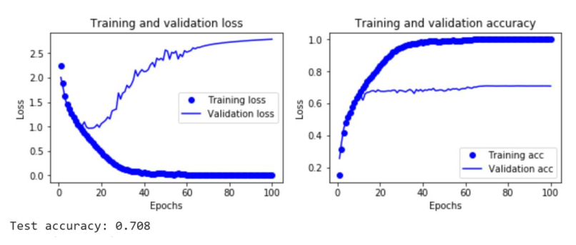
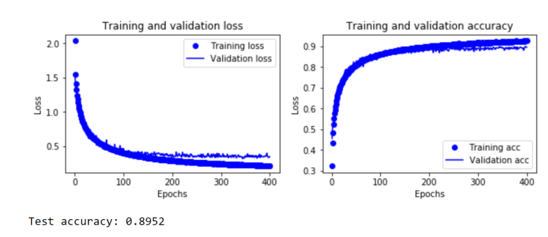

### :dart: Design, train, test a network similar [LeNet](http://www.dengfanxin.cn/wp-content/uploads/2016/03/1998Lecun.pdf) and apply Regularization methods for sloveing Overfit problem  which has been uesed  [CIFAR-10 dataset](https://www.cs.toronto.edu/~kriz/cifar.html)

#### step 1: train and test model without Regularization 

* model summary

*accuracy chart for train and test data

* Confusion Matrix 

#### step 2: train and test model along with Regularization

* Dropout layers:It is used to prevent over-fitting. In such a way that we randomly ignore a percentage of neurons during network training. The large number of parameters of the network and the strong dependence between neurons cause the power of each neuron to be limited and overfit on the most data.

* Batch normalization:Instead of normalizing only the initial input, normalize the input of all layers.One of the advantages of using this method is that the weight of some neurons does not increase too much

* Augmentation:More training data for network training

*Enhance model summary

*accuracy chart for train and test data

* Confusion Matrix after regularization

